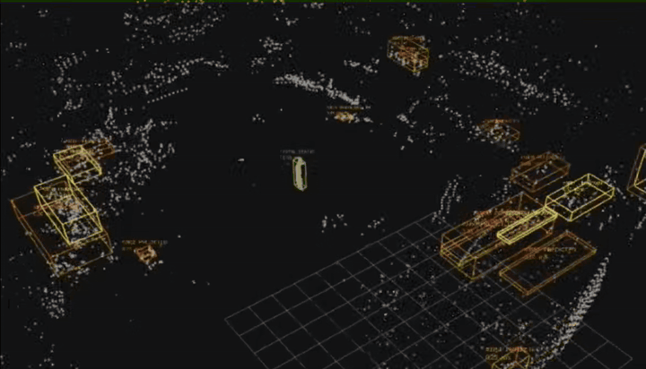

# lidar_object_tracker

基于 LiDAR 与里程计自运动补偿的物体跟踪和动态障碍感知。**ROS 1 Noetic / C++17**。

跟踪、适配器、离线评价和测试均为 C++；不依赖 NumPy、SciPy、rospy 或 M-detector 工程。
ROS/catkin 自带构建、启动和测试工具仍可能使用系统 Python，这是 ROS 工具链自身的依赖。
本项目尚未实现 KF、IMM 或规划器执行闭环。EGO 工程已新增独立旁路预测桥，进展与启动方式见 [接入实施计划](docs/EGO_INTEGRATION_IMPLEMENTATION_PLAN.md)。

当前 EGO 统一入口使用 tracker 环境点云，并保留动态预测代价和候选碰撞检查；不增加预测超时保持或制动接管。启动方式与验证范围见 [环境点云统一接入](docs/STATIC_ENVIRONMENT_INTEGRATION.md)。

剩余开发与验收顺序见 [动态避障剩余工作总计划](docs/REMAINING_DYNAMIC_AVOIDANCE_PLAN.md)（恢复版已复测正常，移动障碍待测试）。

> 新统一入口现使用 tracker 环境点云和动态预测，不再需要单独启动 lidar2word.sh。见 [环境点云统一接入](docs/STATIC_ENVIRONMENT_INTEGRATION.md)。

## 效果演示



[▶ 点击观看物体跟踪演示（MP4）](docs/assets/tracking-demo.mp4)

## 构建

需要 ROS Noetic、Eigen3、PCL（common/kdtree）、jsoncpp、yaml-cpp，以及已编译的
livox_ros_driver2 消息。离线评价使用 rosbag、gazebo_msgs；不需要运行 Gazebo。

```bash
cd ~/APS/lidar_object_tracker
./tools/build.sh
```

默认创建或复用相邻 `~/APS/lidar_object_tracker_ws`，以 C++17 Release、2 个并行编译任务构建。
`TRACKER_WS` 可指定其他工作空间。构建和启动均可用
`LIVOX_DRIVER_SETUP=/实际驱动工作空间/devel/setup.bash` 指定驱动环境。
默认查找相邻 livox_ros_driver2_ws 或机载 ~/auto/kufei_auto/uav_indoor/devel。

## 仿真

先保持 Gazebo、Livox 和 MAVROS 运行：

```bash
cd ~/APS/lidar_object_tracker
./run.sh input_source:=livox_mavros rviz:=true
```

一条命令同时启动适配器、跟踪器和 RViz。默认输入 `/livox/lidar` 和
`/mavros/local_position/odom`。默认外参 xyz=[0,0,0.235077]、xyzw=[0,0,0,1]。
只接受 offset_time=0 的瞬时点云，max_dt 默认 0.05 秒，不做扫描去畸变。

## 真机

机载机首次检出代码后先运行 `./tools/build.sh`，再执行：

```bash
cd ~/APS/lidar_object_tracker
./run.sh input_source:=livox_mavros_real rviz:=true \
  lidar_translation:='[0.0, 0.0, 0.05]' \
  lidar_quaternion:='[0.0, 0.0, 0.0, 1.0]'
```

这是原测试的外参，需确认实际安装一致；方向 p_base_link = R * p_lidar + translation，
平移米、四元数 xyzw。真机模式两项外参必填。普通 SSH 无图形环境使用 rviz:=false。

逐点时间使用 timebase + offset_time + lidar_time_offset，位置线性插值、姿态 SLERP，
补偿到扫描末时刻，输出同一纳秒时间戳的点云与位姿，禁止位姿外推。
支持 lidar_frame、lidar_time_offset、max_scan_duration、max_odom_gap、max_wait、max_input_age。
必须先修复异常驱动时间并保证时钟一致；本包没有实现 PTP 同步或 IMU 积分。
时钟或定位原点重置后，重启输入适配器和跟踪器。

## 分开启动 / 其他输入

加载 ROS、驱动和本工作空间环境后：

```bash
roslaunch lidar_object_tracker livox_mavros.launch
roslaunch lidar_object_tracker tracker.launch rviz:=true
```

真机适配器改用 livox_mavros_real.launch，并传入两项外参。
单独使用 tracker.launch 时，可通过 cloud_topic、odom_topic、world_frame 接入其他输入。
输入点云与里程计必须同一纳秒时间戳，点云为 body 坐标，frame_id 等于 odom child_frame_id。
跟踪器执行一次 body→world 变换，不应直接传入已转换的世界点云。

## 输出

适配器：`/lidar_object_tracker/input/cloud_body`、`/lidar_object_tracker/input/odom`。
跟踪输出默认在 map 坐标系：

| Topic | 类型 | 内容 |
|---|---|---|
| /lidar_object_tracker/dynamic | PointCloud2 | 当前帧 MOVING 物体簇原始点 |
| /lidar_object_tracker/background | PointCloud2 | 其余点，包括 UNKNOWN、地面和未分组点 |
| /lidar_object_tracker/uncertain | PointCloud2 | UNKNOWN 候选点 |
| /lidar_object_tracker/markers | MarkerArray | ID、轴对齐框、状态和速度箭头 |
| /lidar_object_tracker/tracks | String / JSON | 位置、尺寸、速度、运动证据和运行统计 |

红框 MOVING、绿框 STATIC、黄框 UNKNOWN、橙框 PREDICTED。
运动确认需多帧证据；可靠状态可沿用约 0.8 秒，丢失预测最多 0.5 秒，不生成虚构点云。
background 不能直接视为已确认静态点；地图分流与动态规划需要另外实现。

## C++ 文件

| 文件 | 职责 |
|---|---|
| include/lidar_object_tracker/tracking_core.h + src/tracking_core.cpp | 分组、地面拟合、匈牙利关联、配准、速度和状态 |
| include/lidar_object_tracker/ros_utils.h + src/ros_utils.cpp | 点云读写、坐标变换、参数、JSON 和标记 |
| include/lidar_object_tracker/livox_adapter.h + src/livox_core.cpp | 外参、逐点时间、位姿插值、去畸变 |
| src/livox_adapter.cpp | 两种适配器的 ROS 接收、配对和发布 |
| src/object_tracker.cpp | 有界缓存和单工作线程跟踪节点 |
| src/livox_to_body.cpp、src/livox_real_to_body.cpp | 适配器可执行入口 |
| tools/evaluate_bag.cpp | 录包重算、已录结果评价、CSV/JSON 导出 |
| tests/*.cpp、tests/scenes.h | 核心行为与 ROS 链路测试 |

参数位于 config/tracking.yaml，重启生效。默认值和算法判据保留原 Python 实现。
PCL 最近邻使用 float，地面精拟合使用 Eigen 协方差特征分解；不承诺任意输入逐比特等价。
仿真采用有界、最近时间的一对一配对；异步到达顺序下不保证与原 Python 同步器选择同一配对。

## 验证

```bash
./tools/test.sh
```

C++ 核心测试和两套隔离 ROS Master 端到端测试，只发送合成 /migration/raw、/migration/pose，
不向用户雷达或 MAVROS 话题发布。迁移与录包对照结果见 docs/CPP_MIGRATION.md。

## 离线评价

加载本工作空间后：

```bash
rosrun lidar_object_tracker evaluate_bag /路径/live.bag --output /tmp/tracker_eval
rosrun lidar_object_tracker evaluate_bag /路径/live.bag --recorded --output /tmp/tracker_recorded_eval
```

默认配置 config/tracking.yaml，可用 --config 覆盖；兼容旧、新两套输出话题。
只有评价工具读取 Gazebo iris/unit_box 真值；实时算法不读取模型名、尺寸或真值。
无真值录包可输出性能和对象数量统计，不能生成箱子覆盖率。

## 范围与来源

仍需验证纯原地旋转、紧贴或交叉目标、复杂遮挡、倾斜地面及真实飞行。
缺少可靠地面时不做新的物体分类。历史结果见 docs/HISTORICAL_VALIDATION.md。
来源和许可证范围见 NOTICE.md，原 LICENSE 保持原样。

## 当前 Gazebo 场景与 EGO 旁路预测

APS/Gazebo 的 `mission_auto_avoid` 场景使用 0.43 m 雷达高度：

```bash
./run.sh input_source:=mission_auto_avoid rviz:=true
```

此场景配置不会覆盖 `livox_mavros` 的旧默认外参，真机模式仍须显式传入外参。
新增 `/lidar_object_tracker/full` 为同帧、未经动静筛除的 map 点云；它与 background、dynamic 共用时间戳。
tracks JSON 新增精确整数 `stamp_ns` 和每次 tracker 进程启动生成的 `session_id`。

若需同时启动 EGO 工程的预测桥，使用以下入口，替代上面的 tracker 单独启动命令：

```bash
bash ~/APS/EGO-Planner-v2/tools/start_tracker_shadow.sh rviz:=true
```

旁路输出为 `/tracker_prediction/predictions`、`/tracker_prediction/markers`、`/tracker_prediction/status`。
默认仍为旁路。启用 EGO 外部预测消费者的新入口为 `start_singlepoint_tracker.sh`，详见 [M2 接入说明](docs/EGO_EXTERNAL_OBSTACLES.md)。该入口使用 full 点云建图，尚未做 background 分流；暂时保留原 `lidar2word.sh` 用于 RViz/TF 对照。
