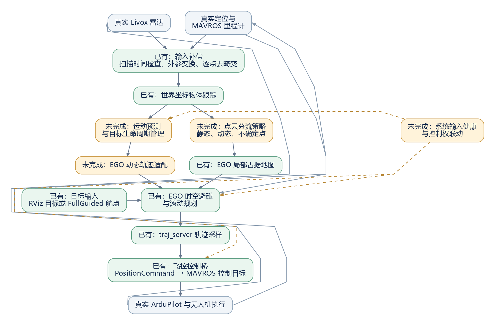

# 真机动态避障闭环流程与完成状态

> **2026-09-16 更新**：新 `start_singlepoint_tracker.sh` 已统一启动 tracker、预测、环境点云、速度转换和 TF，EGO 使用 `/tracker_environment/cloud`；不再单独运行 `lidar2word.sh` 或 `start_tracker_shadow.sh`。旧启动方式仅用于历史/原模式对照。当前说明见 [环境点云统一接入](STATIC_ENVIRONMENT_INTEGRATION.md)。

> **后续工作以 [动态避障剩余工作总计划](REMAINING_DYNAMIC_AVOIDANCE_PLAN.md) 为准：用户已确认恢复版运行正常，移动障碍物尚未测试。**

> **当前状态（恢复预测能力后）**：动态预测重新参与优化代价和候选轨迹碰撞检查；预测为空、过期、停更或不可用时仅移除对应预测约束，不增加保持、恢复、制动接管或健康阻断。地图与里程计继续走原 `/world_cloud`、`/ego/odom_world_velocity`。预测入口为 `start_singlepoint_tracker.sh`，原模式入口仍为 `start_singlepoint.sh`。当前实现、启动及验证范围见 [预测约束接入说明](PREDICTION_ONLY_INTEGRATION.md)。

更新日期：2026-09-15。

后续实施顺序、工程改动与验收条件见 [Tracker → EGO 接入实施计划](EGO_INTEGRATION_IMPLEMENTATION_PLAN.md)。

本文依据 lidar_object_tracker、EGO-Planner-v2 的 main_ws 和 uav_application 当前工作树整理。描述已有能力与后续接入方案，不代表整套真机动态避障已经验证通过。2026-09-15 已实现旁路预测首版并完成静态场景采样；M2 已增加规划端消费者、动态代价与失效保持，尚待实际 Gazebo/真机验收，未操作飞控。详见 [M2 接入说明](EGO_EXTERNAL_OBSTACLES.md)。

状态说明：

- **已有**：存在对应实现，可作为闭环基础；不等于整条链路已完成真机验证。
- **部分完成**：已有模块，但缺接口、策略或系统联调。
- **未完成**：尚未实现对应能力或尚未完成相应验证。
- **首版可选**：不作为首版动态避障闭环的前置工作。

## 1. 首版目标

建议首版范围为：**单架无人机，在已建立定位、已经起飞的条件下，接收一个目标点，持续感知移动物体、预测冲突、滚动规划，通过 MAVROS 驱动 ArduPilot 执行，直到实际到达目标点或交还控制权。**

目标可先由 RViz 下发；后续可由 uav_application 的 FullGuided 航点任务提供。KF、IMM、多机协同和 AUTO/GUIDED 自动切换不作为首版前置条件。运动预测首版建议采用匀速模型，预测时长与误差余量通过数据验证确定。

## 2. 总体数据闭环



绿色表示已有实现，橙色表示未完成，灰色表示外部传感器与飞控；虚线表示系统状态联动。已有实现不等于整套真机闭环已验证。

[查看完整尺寸流程图](assets/real-dynamic-avoidance-flow.png) · [可编辑流程图源文件（Graphviz）](assets/real-dynamic-avoidance-flow.dot)

无人机运动会改变下一帧雷达观测和里程计，更新后的数据再次参与跟踪与规划，这才形成反馈闭环。仅在 RViz 显示动态点云或预测轨迹，不代表执行闭环完成。

### 2.1 运动预测与 EGO 接口适配：把物体运动状态变成未来轨迹

这部分的作用是：**根据动态物体的位置、速度和时间戳生成未来轨迹，再送入 EGO 现有的动态避碰接口。** 仅有速度还不够，必须知道速度的方向、物体所在位置以及该状态对应的时刻。

首版匀速预测可表示为：

```text
p(t) = p0 + v × (t - t0)

p0：目标在 t0 时刻的位置
v ：同一世界坐标系中的速度向量
t ：需要预测的未来时刻
```

例如目标在 t0 时刻位于 (2, 3, 1) m，速度为 (1, 0, 0) m/s，则匀速假设下 1 秒后位于 (3, 3, 1) m。实际实现还需要补偿从观测到规划的处理延迟，并限制预测有效期。

处理顺序为：

1. 从 tracker 读取目标 ID、位置、速度、尺寸、状态及时间信息。
2. 根据运动模型生成带时间的未来轨迹，并根据目标尺寸和预测误差设置避碰范围。
3. 转换为 EGO 已支持的 `traj_utils/MINCOTraj` 内容，封装在独立 `traj_utils/ExternalObstacleArray` 快照中；当前发布到旁路 `/tracker_prediction/predictions`，新入口已接入规划端消费者。
4. EGO 比较无人机与物体在**同一未来时刻**的位置，判断是否需要绕行或调整轨迹时间。

这相当于把现有 demo 的“手柄程序生成障碍轨迹”，替换成“真实雷达跟踪结果生成障碍轨迹”。EGO 动态避碰核心已有，真实目标预测的旁路实现已有，规划器中的外部障碍消费者和安全联动已实现首版，实际飞行验证仍未完成。

### 2.2 环境点云分流与地图更新：提供环境占据并清除旧障碍

这部分的作用是：**把适合建图的环境点云发送给 EGO 地图，同时管理障碍占据的更新与清除。** 点云必须与规划器、里程计使用一致的世界坐标基准。

当前 `background` 并不完全等于确认静态点云，里面还包含地面、未分组点和 UNKNOWN 点；`uncertain` 中的 UNKNOWN 候选点也包含在 `background` 中，不能把两个输出当成互不重叠的集合。

拟采用的分流原则如下，具体地图实现仍待完成：

| 点的性质 | 处理原则 |
|---|---|
| 确认静态、适合建图的环境点 | 用于环境地图；地面等点按地图规则处理 |
| 确认动态物体的点 | 由动态目标预测参与避碰，避免长期写入静态地图 |
| UNKNOWN 或其他尚未确认静态的点 | 保守地作为局部障碍处理，不能直接丢弃，也不能自动视作长期静态环境 |

“地图更新”还需要处理物体状态变化。例如一个箱子原先静止，已经进入占据地图，后来开始移动：即使停止向地图发送该箱子的点，**已经写入的旧占据也不一定自动消失**，因此需要通过经过验证的清除或衰减策略更新地图，并避免误删同一位置的真实静态结构。物体停止后，也需要根据后续观测更新其环境表示。

最终 EGO 同时获得两类信息：**周围环境的占据地图，以及运动物体的未来轨迹。** 这两条链路都需要接入，才能把现有跟踪与规划模块组成完整闭环。

## 3. 按执行顺序逐项检查

| 步骤 | 作用与输入输出 | 当前状态 | 还未完成的工作 |
|---|---|---|---|
| 1. 真实传感器与定位 | Livox 输出原始扫描；MAVROS 输出位姿、速度和飞控状态 | 已有接入路径 | 核实机载驱动、定位来源、时间基准与安装外参；定位算法由外部系统提供 |
| 2. 真机输入补偿 | 原始点云 + 里程计 → 扫描末时刻的 body 点云和同时间戳里程计 | 已有 | 真实安装和运动条件下验证；现有测试包含合成真机链路 |
| 3. 坐标与时间统一 | 跟踪器、地图、预测、规划和目标使用同一个真实坐标基准 | 部分完成 | tracker 默认 map，EGO 默认 world；统一 launch 参数和必要坐标变换，不能只改名称 |
| 4. 物体检测与跟踪 | 点云 → 目标 ID、位置、尺寸、速度、状态、观测年龄 | 已有 | 面向真实移动目标、遮挡与机体运动验证识别效果 |
| 5. 环境点云分流 | MOVING 点、静态候选点、UNKNOWN 点分别进入适当的环境表示 | 部分完成 | 已有 dynamic/background/uncertain 输出，但地图融合与清除策略未接入；background 不是全部已确认静态 |
| 6. 运动预测 | 目标当前状态 → 一段未来位置轨迹和相应避碰范围 | 部分完成 | 已有 C++ 匀速预测、尺寸余量与有效期；运动录包误差和真机标定待完成 |
| 7. 目标生命周期 | 新目标、更新、短时丢失、停止、过期、时间重置 | 部分完成 | tracker 与外部快照已有状态管理；规划端已联动更新、删除、重置和保持，实际场景待验收 |
| 8. EGO 输入适配 | 跟踪预测结果 → EGO 可读取的动态轨迹 | 部分完成 | 旁路节点已完成 ID、时间、尺寸与输入校验；EGO 消费者与失效保持已有；实际交会和真机验证待完成 |
| 9. 局部地图与轨迹规划 | 当前位姿 + 目标 + 环境地图 + 动态轨迹 → 可执行局部轨迹 | 已有核心，未接真实感知 | 动态 demo 目前使用手柄生成的预测；真实跟踪数据端到端联调未做 |
| 10. 轨迹执行采样 | EGO 多项式轨迹 → 位置、速度、加速度、偏航指令 | 已有 | 与真实执行延迟和跟踪误差一起验证 |
| 11. 飞控控制桥 | PositionCommand → MAVROS PositionTarget | 已有 | 现有桥具备显式启停、状态门控、限幅和接收超时处理；动态感知闭环尚未验证 |
| 12. 实际飞行反馈 | ArduPilot 执行 → 新位姿、新点云 → 再规划 | 外部飞控与反馈接口已有 | 验证包含真实移动目标的完整反馈闭环 |
| 13. 任务开始和结束 | 下发目标、启用控制、实际到达、结束任务或接管 | 部分完成 | 接口已有；首版运行顺序、退出行为与动态避障集成未完成 |
| 14. 统一部署与记录 | 一套 launch/配置/启动说明；记录输入、预测、规划和执行 | 未完成 | 合并两个项目启动依赖、统一命名空间和参数、补充全链路 rosbag 与评价 |

## 4. 已有接口与拟新增接口

| 连接 | Topic / 类型 | 状态与约定 |
|---|---|---|
| 雷达 → tracker 适配器 | `/livox/lidar`，Livox CustomMsg | 已有 |
| MAVROS → 感知/规划/控制 | `/mavros/local_position/odom`，nav_msgs/Odometry | 已有；应统一真实坐标和时间基准 |
| 输入适配器 → tracker | `/lidar_object_tracker/input/cloud_body` 与 `/lidar_object_tracker/input/odom` | 已有；精确时间戳配对 |
| tracker → 预测模块 | `/lidar_object_tracker/tracks`，std_msgs/String 内含 JSON | 旁路消费者已实现；包含 stamp、stamp_ns、session_id、frame_id、reset、ground_valid 和 objects |
| tracker → 环境地图适配 | dynamic/background/uncertain，sensor_msgs/PointCloud2 | 输出已有；地图分流消费者未实现 |
| 预测适配 → EGO | 旁路 `/tracker_prediction/predictions`，traj_utils/ExternalObstacleArray（内含 MINCOTraj） | 消息与发布端已有；规划端独立缓存、代价和保持联动已有；实际交会验证待完成 |
| 地图适配 → EGO | 拟提供专用世界坐标点云 topic，再配置到单机 launch 的 lidar_topic | 新 topic 名尚未定；不能继续把全部原始世界点云当静态环境融合 |
| 目标 → EGO | `/goal_with_id`，quadrotor_msgs/GoalSet | 已有；RViz 原始目标可先经过 goal_altitude_override |
| EGO → traj_server | `/drone_0_planning/trajectory`，traj_utils/PolyTraj | 已有 |
| traj_server → 飞控桥 | `/drone_0_planning/pos_cmd`，quadrotor_msgs/PositionCommand | 已有 |
| 飞控桥 → MAVROS | `/mavros/setpoint_raw/local`，mavros_msgs/PositionTarget | 已有 |
| 控制权开关 | `/position_cmd_to_mavros/enable`，std_srvs/SetBool | 已有；关闭表示停止桥输出，不能直接等同于飞控已悬停或已完成模式切换 |

预测与适配首版已由 EGO 工程的独立 C++ 节点 tracker_prediction_node 实现，读取 tracker JSON，发布 ExternalObstacleArray。tracker 自身仍不依赖 traj_utils。

MINCOTraj 的 drone_id 为 int16，复用时需要有限、可回收的目标 ID 映射并与无人机 ID 隔离。该消息没有 frame_id、目标尺寸数组、预测协方差或专用删除字段，因此统一坐标、保守几何近似、有效期和失效处理必须作为适配约定完成。

## 5. 一次完整任务的运行过程

1. **启动底层输入**：雷达驱动、定位、MAVROS 提供真实数据。已有相关工程，机载配置待确认。
2. **启动感知链路**：适配器去畸变，tracker 输出物体状态。已有实现，跨项目统一启动待完成。
3. **建立规划环境**：新模块生成预测并分流点云；EGO 收到同一坐标和时间基准的数据。此段未完成。
4. **准备任务目标**：首版接收单个目标点；自动航点以后可复用 FullGuided。目标接口已有。
5. **启用执行**：在既定飞控模式和控制权流程下启用控制桥，并等待新的有效规划指令。现有桥接口可用，整套启停流程待联调。
6. **滚动动态避障**：每次目标观测更新预测；EGO 检查自己的未来轨迹与目标未来位置是否冲突，必要时重规划；控制桥持续传递指令。中间接口已接入并进行隔离测试，实际交会闭环待验收。
7. **处理变化**：目标停下、突然改变方向或短时遮挡时，更新预测和地图表示；目标失效与传感器中断触发对应系统行为。tracker 部分能力已有，系统联动待完成。
8. **实际到达与结束**：以真实里程计检查完成情况，保持终点或按任务约定交还控制权；保存记录。现有终点输出和 FullGuided 任务基础可复用，动态闭环验证待完成。

## 6. 工作拆分与完成条件

| 工作包 | 交付物 | 完成条件 |
|---|---|---|
| A. 坐标、时间与接口统一 | 统一配置和可检查的数据约定 | 同一目标、飞机和地图在同一坐标基准正确对齐，数据年龄可追踪 |
| B. 目标预测与 EGO 适配 | C++ 预测适配节点 | EGO 接收真实 tracker 结果；ID、尺寸、时间、reset、丢失和过期行为可验证 |
| C. 地图分流 | 环境点云适配与更新策略 | 动态目标不长期固化为静态残影；UNKNOWN 有明确保守表示 |
| D. 单机启动集成 | 面向真实输入的 launch、参数与操作说明 | 不依赖手柄或假里程计，能串起感知、规划与 MAVROS 控制桥 |
| E. 运行状态联动 | 输入健康、控制权与退出策略 | 感知停更、预测失效、规划失败等情况有明确可验证行为 |
| F. 全链路验证 | rosbag、评价结果与测试记录 | 逐步完成录包/台架、含真实飞控响应的仿真，以及受控真机测试 |

最低验证场景包括静止环境、目标横穿、迎面接近、目标停止/反向、短时遮挡、输入中断、真实机体运动。记录实际最小间距、目标预测误差、轨迹执行误差、输入到执行延迟、重规划耗时与失败次数、控制权切换结果。通过阈值应结合机型、目标尺寸、速度和实测误差确定；本次不凭空设定。

## 7. 自动任务层与暂缓事项

| 能力 | 当前情况 | 首版关系 |
|---|---|---|
| RViz 单点目标 | 已有目标及高度处理接口 | 首版建议使用 |
| FullGuided 航点任务 | uav_application 已有起飞、航点推进与降落交接代码 | 可后续接入动态避障链路；整条动态流程未验证 |
| AUTO 巡航 → GUIDED 避障 → AUTO 恢复 | AutoAvoid 仅有部分框架，完整切换逻辑未完成 | 若要求此种运行方式，需要额外完成任务状态机 |
| KF / IMM | tracker 当前未实现 | 首版可选，先验证匀速预测闭环 |
| 多机协同 | EGO demo 已有多机轨迹广播 | 首版单机不依赖此项，只复用动态轨迹接口 |

此前分析中的提前绕障生效条件、过期处理不一致、地图残影/纯点云超时、手柄预测模型和调试开销，本轮按要求暂不修复。与真实感知直接相关的有效期、地图更新和输入健康问题仍保留在 B/C/E 及真机验证未完成项中，不能因暂缓处理就视作已完成。手柄模型不进入拟议真机链路。

## 8. 代码依据

- lidar_object_tracker：`launch/real.launch`、`launch/livox_mavros_real.launch`、`src/livox_core.cpp`、`src/livox_adapter.cpp`、`src/tracking_core.cpp`、`src/object_tracker.cpp`、`docs/CPP_MIGRATION.md`。
- EGO-Planner-v2/main_ws：`ego_ardupilot_bridge/launch/single_drone_ardupilot.launch`、`ego_ardupilot_bridge/src/position_cmd_to_mavros.cpp`、`ego_ardupilot_bridge/src/goal_altitude_override.cpp`。
- EGO-Planner-v2/main_ws：`planner/plan_manage/src/ego_replan_fsm.cpp`、`planner/plan_manage/src/traj_server.cpp`、`planner/traj_opt/src/poly_traj_optimizer.cpp`、`planner/plan_env/src/grid_map.cpp`、`planner/traj_utils/msg/MINCOTraj.msg`。
- uav_application：`src/uav_application/src/waypoint_mission_task/waypoint_mission_full_guided.cpp` 和 `waypoint_mission_auto_avoid.cpp`。

以上 EGO 路径均相对于 `swarm-playground/main_ws/src/`。状态基于源码与既有记录，未将模块测试或旧仿真记录当成本次真机闭环验证。


### 起飞后悬停修正（2026-09-15）

当前仿真入口增加无地面聚类降级：地面不可见时继续目标关联与预测，完整点云继续供 EGO 建图；空输入和超时仍触发保护。该模式不支持把 background 当作已可靠剔除动态物体的纯静态地图。协议、启动及验收要求见 [EGO 外部障碍接入说明](EGO_EXTERNAL_OBSTACLES.md#2026-09-15起飞后地面不可见的处理)。完整自动任务起飞复测待执行。


### 后退与频繁起停修正（2026-09-15）

已实现并离线验证：单个目标观测过期不再使整帧失效；快照接收后的短暂老化由有限预测域与整帧超时约束；外部模式急停从实测速度减速，结束后保持，制动过程中不反复重置；连续健康0.3秒且停稳后才恢复规划。SITL完整自动任务和地图占据冲突仍待复测。实现与测试见 [外部障碍接入说明](EGO_EXTERNAL_OBSTACLES.md)。
