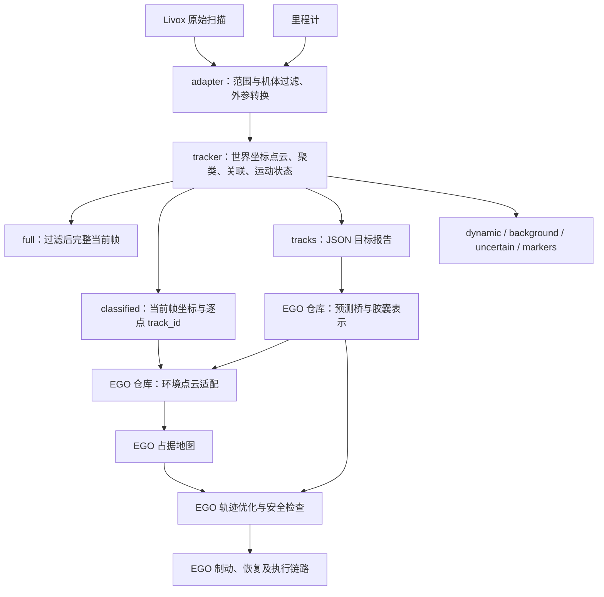

# lidar_object_tracker 未提交改动详细说明

更新日期：2026-09-21。本文按当前工作树与 HEAD 的差异编写，包含源码、配置、启动、测试及新增文档；不把历史计划中的“已通过”当作本次重新测试结果。

## 1. 阅读结论与快照范围

这批改动把原来的独立物体跟踪器补齐为 EGO 动态避障的感知输入端，主要解决四件事：输入点云过滤与空帧传递、无地面时继续跟踪、高柱子及局部可见表面的运动估计、向 EGO 提供同帧点云和明确的目标身份。

它没有在 tracker 内实现 EGO 轨迹优化、制动、自动恢复或飞控控制。这些属于另一仓库 EGO-Planner-v2；tracker 的结果质量会影响它们，但两者不能混为一项修改。

| 项目 | 本次检查基准 |
|---|---|
| 仓库 | `/home/zhoubao/APS/lidar_object_tracker` |
| HEAD | `d067f2eada613fe500b8c0d8ac8a48672463bfd5` |
| 文档写入前的未提交文件 | 27 个：17 个已跟踪文件修改，10 个未跟踪新文件 |
| 已跟踪文件 diff 统计 | 435 行增加、43 行删除；不含未跟踪文件全文 |
| 新文件构成 | 7 份 Markdown、1 份 Graphviz 源文件、1 张 PNG、1 份场景 launch |
| 本次交付 | 仅新增本文；因此写入后应为 28 个未提交文件 |
| 验证边界 | 阅读 diff、相关完整实现及测试断言，核对文件清单；未重新编译、运行 ROS 测试或飞行 |

与 EGO 的配套说明见 [EGO 未提交改动说明](../../EGO-Planner-v2/docs/UNCOMMITTED_DYNAMIC_AVOIDANCE_CHANGES_CN.md)。最近碰撞与后续修复进度见 [动态避障问题记录](../../EGO-Planner-v2/docs/DYNAMIC_AVOIDANCE_CRASH_FIX_CN.md)。这两个链接依赖两个仓库在 APS 下并列放置。

## 2. 它在当前链路中的位置



真机适配器还保留逐点时间与里程计插值去畸变；仿真适配器要求瞬时扫描。预测和地图分流的消费者位于 EGO 仓库，不能只编译 tracker 就认为规划端也更新了。

当前 EGO 集成输入应理解为 `/tracker_environment/cloud`，而不是直接把 `background` 当作纯静态地图。EGO 后续保留动态点的策略也可能使移动障碍出现在膨胀地图中：这不等于 tracker 把目标认成 STATIC，更不能仅凭能绕开物体就证明预测独立起效。

## 3. 输入适配：过滤、空帧与坐标

### 3.1 机体过滤与最大距离

[src/livox_adapter.cpp](../src/livox_adapter.cpp) 新增统一 `keep(raw)` 判断，仿真和真机路径共用：

1. 原始点必须是有限数值。
2. 雷达坐标距离必须大于 `min_range` 且不大于 `max_range`。
3. 用安装外参将点转换到 body；启用 `self_filter_enabled` 时，删除落在机体轴对齐盒内的点。

过滤盒使用半尺寸：X/Y 各 1.45 m、Z 0.9 m，对应完整宽度 2.9 × 2.9 × 1.8 m。它是配置过滤区域，不是根据当前观测自动识别出的机体轮廓。盒内真实近障碍点同样可能被删除，所以不能把 `/full` 理解成“包含所有真实障碍回波”。

适配器代码默认 `self_filter_enabled=false`、`min_range=0.3`、`max_range=80`。当前 EGO 统一入口另行设置机体过滤及 0.05 m 最小距离；tracker 单独启动不自动等于 EGO 集成配置。新增检查拒绝非法最大距离及非正/非有限盒尺寸。

### 3.2 空扫描继续传递

[src/livox_core.cpp](../src/livox_core.cpp) 的 `convertLivox` 不再把零点扫描或全部点被过滤的扫描一律作为异常丢弃；可输出保留时间戳的空点云。点数声明不一致和超过上限仍拒绝。

仿真 adapter 在过滤前检查点数及每个点的 `offset_time`，只接受时间偏移全零的瞬时扫描；过滤后更新 `point_num` 再转换。这避免把带逐点扫描时间的数据当作瞬时帧处理。

真机路径把统一过滤结果保存为掩码，仍执行既有去畸变后再选取有效点，移除了“全部回波被过滤就立即异常”的分支。但真机原始零点消息是否可达输出还受原来的扫描时间和去畸变校验影响；不能据仿真空帧测试宣称任意真机空消息都已支持。

“新鲜空帧”“没有收到帧”“分割可用”是三件不同的事：适配器能发送空帧，不意味着 tracker 会报告分割健康，更不意味着地图应清空。

### 3.3 frame 参数贯通

`livox_mavros.launch`、`livox_mavros_real.launch` 新增 `world_frame` / `body_frame` 参数，默认 map / base_link；`simulation.launch`、`real.launch` 把这些参数传入适配器，统一顶层与输入层的配置。

这减少硬编码 frame 不一致，但参数名称本身不是 TF 变换；外参、里程计物理坐标及消息 frame 仍须真实一致。真机顶层仍要求显式提供平移与四元数，没有把仿真安装高度默认套给真机。

## 4. 无地面聚类及输出语义

[src/tracking_core.cpp](../src/tracking_core.cpp) 增加 `allow_groundless`，底层默认 0，mission_auto_avoid 场景显式设为 1。

| 输入与配置 | 分割结果 | 点云及跟踪行为 |
|---|---|---|
| 地面可用 | `ground_valid=true`、`segmentation_mode=ground_filtered` | 保持地面过滤后聚类；MOVING 点可进入 dynamic |
| 地面不可用，允许降级 | `ground_valid=false`、`segmentation_valid=true`、`unfiltered` | 不做地面高度剔除，继续聚类与历史关联 |
| 地面不可用，不允许降级 | `segmentation_valid=false`、`unavailable` | 无本帧有效分割；不能解释成没有障碍 |
| 空输入或全部点非有限 | `segmentation_valid=false`、`unavailable` | 不把空观测当作环境已清空的证据 |
| 有有限点但范围内没有点，允许降级 | 可形成有效的零检测报告 | 只说明当前范围内的处理结果，不证明视野外无障碍 |

无地面时，当前帧点保留在 background，dynamic 为空；观测目标的 uncertain 标记更保守。然而，只要目标状态达到 MOVING，其原始点索引仍写入 `moving_owner`，可由 classified 提供给 EGO。

所以 **dynamic 为空并不等于没有运动目标**。判断应同时看 tracks 的状态、分割模式、classified 的 ID 与 EGO 实际接收的预测。

该修改解决“起飞后地面退出视野就无法继续新分类”的一类问题。它不会补出未观测的物体几何；相连地面、墙面与目标仍可能合簇，也没有以旧地面无限维持健康。

## 5. 高柱子与可见表面变化修正

### 5.1 竖向连接距离独立配置

原聚类采用各向同性球邻域，默认距离 0.32 m。高柱侧面上下扫描线间距较大时，同一物体容易被切成多个小簇。

新增 `column_distance`：当它大于水平 `cluster_distance` 时，用足够大的球邻域找到候选邻居，再要求水平距离不超过 0.32 m、竖向差不超过配置值。YAML 当前设为 2.0 m，底层默认 0 表示保留原球邻域。

这是点邻接关系，不是“整根柱子最多高 2 m”；连通可以逐段传递，因此能形成更高的簇。同样，水平足迹接近、竖向相邻的不同物体也可能被串接，不能视为语义上的柱体识别。

### 5.2 大尺寸过滤改为只看水平

`max_cluster_size=5.0` 原来检查 XYZ 最长边，现在只检查 X/Y 最长边；不会仅因高度超过 5 m 丢掉柱子。特别小的簇仍有尺寸范数限制，点数门槛仍然保留。

**这一行为是源码整体改变，没有独立开关。** 即使把 `column_distance` 或 `shape_horizontal_only` 设回 0，也不会恢复原来按高度丢簇的规则。

### 5.3 速度从包围盒中心差分改为点簇质心差分

Detection 与 Observation 新增 `centroid`，按簇内原始有效点求均值。速度使用历史窗口内时间差至少 0.2 s 的质心差分，再取分量中位数；不再直接对包围盒中点差分。

动机是：突然多看到一个侧面或更高的一段表面时，包围盒中心会跳，原算法可能把它当成物体速度。质心可以减轻特定场景的影响，但仍受点密度及可见表面变化影响，不能保证消除假速度。

目标报告和关联仍使用包围盒中心；包围盒仍由体素点的 2% / 98% 分位边界形成。几何配准的平移参考也仍是包围盒中心位移。此次不是把所有中心计算统一改成质心。

### 5.4 可见高度波动时抑制竖向速度

新增 `motion_vertical_tolerance`：比较速度窗口内各帧高度与窗口首帧高度，最大差超过阈值时，把估计 `vz` 置零。YAML 当前为 0.20 m，底层默认 0 表示关闭。

它针对“可见部分变多/变少导致假上下运动”。这是一条启发式规则，不是垂直运动观测器；真实上下运动同时伴随高度变化时，也可能被压成零。设置阈值后不会补全目标高度或提高尺寸置信度。

### 5.5 形状变化只看水平尺寸

新增 `shape_horizontal_only=1` 后，运动证据与目标关联的形状差只使用 X/Y 尺寸，避免可见高度变化反复打断 MOVING。底层默认 0，仍使用三维尺寸差。

运动几何形状差门槛 0.65、关联形状差门槛 0.85 仍在；配准重叠率、配准误差和关联三维中心距离仍参与判断。柱子近距离只剩薄片、水平尺寸骤变或中心跳动时，仍可能变 UNKNOWN 或关联失败。

### 5.6 影响范围

| 项目 | 底层默认 | 当前共用 YAML / 场景值 | 说明 |
|---|---:|---:|---|
| 跟踪 max_range | 25 m | 60 m | 由观察者 body 原点计算；与 adapter 雷达坐标 80 m 过滤不是同一层 |
| cluster_distance | 0.32 m | 0.32 m | 水平连通阈值 |
| column_distance | 0 | 2.0 m | 竖向连接 |
| max_cluster_size | 5 m | 5 m | 当前代码只检查水平尺寸 |
| shape_horizontal_only | 0 | 1 | 形状差只看 XY |
| motion_vertical_tolerance | 0 | 0.20 m | 可见高度不稳定时抑制 vz |
| allow_groundless | 0 | mission_auto_avoid 为 1 | 共用 YAML 未统一启用 |
| motion_window | 0.55 s | 0.55 s | 本次未改值；不是新加长的速度窗口 |

simulation 和 real 顶层默认都加载同一份 tracking.yaml，因而柱状聚类等 YAML 改动也影响真机入口。扩展到 60 m 只扩大处理范围，并不代表远距识别精度已经验证；当前用户暂缓远距精度优化的决定仍适用。

## 6. EGO 所需接口

### 6.1 点云

| 默认话题后缀 | 具体含义 | 使用时的边界 |
|---|---|---|
| `/full`（新增） | tracker 当前完整世界坐标输入点集 | 已经过前端过滤与变换，不是原始雷达无损副本 |
| `/classified`（新增） | 与 full 相同点集，附逐点 `track_id` | x/y/z 为 FLOAT32，track_id 为 INT32 |
| `/dynamic` | 有地面时，本帧已确认 MOVING 的点 | 无地面降级时为空 |
| `/background` | 非 dynamic 的点 | 包含地面、UNKNOWN、未分组及降级保留点，不等于纯静态 |
| `/uncertain` | 不确定或降级目标点 | 与 background 重叠，不应重复叠加成互斥分区 |

classified 的 `track_id>0` 表示该点属于本帧实际观测到的 MOVING 目标；0 表示不带这种运动归属。它不是所有 STATIC/UNKNOWN 目标的完整实例分割编号。短时预测轨迹不能凭空生成本帧点云。

逐点标记依据簇的原始索引，避免单纯按包围盒删除其内部的所有点。不过，如果聚类本身合错了物体，逐点 ID 也会继承这个错误。

full、classified、dynamic、background 等使用同一帧 header；EGO 可按整数时间戳匹配点云和预测，决定哪些点保留建图。具体保留/剔除政策属于 EGO 的环境适配器，不能仅依据本仓库的 dynamic 输出推断。

### 6.2 tracks JSON

| 新字段 | 实现位置 | 目的与限制 |
|---|---|---|
| `stamp_ns` | ros_utils.cpp | UInt64 纳秒时间，避免只用浮点秒匹配时的精度损失 |
| `session_id` | object_tracker.cpp | 节点构造时由墙钟纳秒生成的字符串，帮助识别进程重启；不是每帧变化或密码学唯一 ID |
| `segmentation_valid` | tracking_core → ros_utils | 区分分割可用与仅地面不可用 |
| `segmentation_mode` | 同上 | ground_filtered / unfiltered / unavailable |

旧 stamp、frame_id、ground_valid、reset、objects 等保留。进程重启与进程内 reset 不是同一个概念；消费者需要按自身协议处理，新增 session 字段并不自动证明下游所有缓存已正确清理。

## 7. 启动、显示与编译

新增 [mission_auto_avoid.launch](../launch/mission_auto_avoid.launch) 复用 simulation.launch，设置安装平移 `[0,0,0.43]`、单位四元数和 allow_groundless=1。0.43 m 来自当前仿真安装的 0.38 + 0.05 m，不是通用真机外参。

[run.sh](../run.sh) 新增 `input_source:=mission_auto_avoid` 分支及帮助文字；原默认仍是 livox_mavros。原有驱动/工作空间加载和路径检查不是本次新增的算法功能。新场景 launch 自身不启动 Gazebo、MAVROS 或 EGO。

仅启动 tracker 的命令：

```bash
bash /home/zhoubao/APS/lidar_object_tracker/run.sh input_source:=mission_auto_avoid rviz:=true
```

当前完整 EGO 集成用已有入口，不应再重复启动一个 tracker：

```bash
bash /home/zhoubao/APS/EGO-Planner-v2/tools/start_singlepoint_tracker.sh
```

RViz 配置新增预测 Marker 显示，消费 `/tracker_prediction/markers`；RViz 不负责生成预测，单独启动 tracker 时不保证该话题存在。

tracker 的编译脚本本次没有修改：

```bash
bash /home/zhoubao/APS/lidar_object_tracker/tools/build.sh
```

该脚本默认在 `/home/zhoubao/APS/lidar_object_tracker_ws` 建立/使用独立 catkin 工作空间，检查 Livox 驱动依赖并执行 `catkin_make -j2 -l2`。可以用 TRACKER_WS / LIVOX_DRIVER_SETUP 覆盖相应路径。

EGO 的 `tools/build_main.sh` 构建 EGO main_ws，不替代 tracker 编译。两个仓库都改了 C++ 时应分别编译；重编译不会更新已运行进程，需要在合适时机重启相关节点。

测试入口仍是：

```bash
bash /home/zhoubao/APS/lidar_object_tracker/tools/test.sh
```

它通过 build.sh 调用 `run_tests_lidar_object_tracker`，再汇总 catkin_test_results。本次文档整理没有执行这些命令。

## 8. 新增和增强的测试具体证明什么

对比 HEAD，test_tracking.cpp 增加 9 项，test_livox.cpp 增加 1 项；ROS pipeline 原测试增加断言。这里统计的是新增测试定义，不是本次执行次数。

| 测试名 / 文件 | 主要断言 | 不应外推的结论 |
|---|---|---|
| GroundlessTracksMotionAndRetainsAllMapPoints | 无地面继续运动跟踪，保留背景，提供 moving_owner | 不证明任意真实无地面场景可分离目标 |
| GroundlessColdStartStaticAndSparseInput | 冷启动静止、稀疏点、空/非法输入、非法开关 | 不证明稀疏报告覆盖整个空间 |
| GroundReturnsRestoreFiltering | 地面恢复后回到正常过滤 | 不代替复杂斜地面测试 |
| TallObjectPassesHorizontalSizeGate | 高度很大的物体不因高度被剔除 | 不证明目标完整几何已恢复 |
| ColumnDistanceMergesVerticallySparseFragments | 竖向稀疏碎片可合成一簇 | 不证明相邻不同物体不会合并 |
| ColumnDistanceKeepsHorizontallySeparatedObjectsApart | 合成水平分离目标保持分开 | 不覆盖贴近/交叉的所有情形 |
| SideFaceFlickerDoesNotAddLateralVelocity | 特定侧面闪现输入下减少假横向速度 | 不证明质心对所有可见性变化无偏 |
| VisibleHeightFlickerDoesNotCreateVerticalVelocity | 高度波动下抑制假 vz | 不验证真实上下运动的完整保真 |
| HorizontalOnlyShapeKeepsTallObjectMoving | 水平形状判据改善合成高目标 MOVING 占比 | 不证明近距水平薄片不再 UNKNOWN |
| EmptyReturnsRemainAnEmptyFrame | 过滤后空帧和零点帧保留 stamp，点数不一致拒绝 | 不等于真机 adapter 全路径空帧验收 |
| check_pipeline_ros.cpp 增强 | full 为 map；报告含 UInt64 stamp_ns 和非空 session；同帧 full 点数等于 background + dynamic | 点数守恒不证明 classified 全部 ID 正确，也不证明规划避障有效 |

旧文档中的 21、24、56 等测试数字来自不同阶段和 catkin 包装统计，不能直接拼成今天的新测试总数。需要执行当前测试后，才能给出本次通过数。

## 9. 与近期碰撞问题的关系

这些修改解释了为什么跟踪现在能处理更高的柱体、地面消失时仍输出运动目标，以及为什么地图与预测能同时工作；但它们没有补齐以下问题：

1. 近距离只看到窄薄表面时，水平尺寸、中心和几何一致性仍可能突变，导致 UNKNOWN 或预测缺失。
2. 当前尺寸仍主要来自当帧可见分位包围盒，没有实现经过验证的完整几何历史保守保持。
3. 速度窗口存在响应时间；突然反向、停止、加速不等于匀速外推正确。没有新增 KF、IMM 或专门反向模型。
4. 全链路安全还取决于观测延迟、EGO 前视时距、可用制动距离、候选轨迹及真实执行误差。
5. 发现危险后无安全刹停空间、保持点仍被移动柱子扫过，需要规划/控制侧处理。tracker 没有实现后退、侧向逃逸或刹停候选安全证明。

近期碰撞记录及定量时间线以 EGO 问题文档为准。本文没有重新读取 rosbag，因此不把这些机制推断写成对某一帧碰撞的独立复核结论。

## 10. 旧说明中需要区别对待的内容

| 文件或描述 | 阅读方式 |
|---|---|
| README 中“移动障碍待测试”“不增加制动接管” | 属于早期接入阶段，已不能概括今天整个 EGO 工作树 |
| README 末尾仍说 full 直接建图、保留 lidar2word | 与同页顶部统一环境点云入口说明不一致，运行以当前集成入口和配置为准 |
| EGO_RESTORE_20260915 | 保存撤回时的故障证据和历史动作，不是要求现在再撤回 |
| PREDICTION_ONLY_INTEGRATION | 描述恢复预测但未恢复额外控制逻辑的阶段，不是当前所有控制能力清单 |
| EGO_EXTERNAL_OBSTACLES / IMPLEMENTATION_PLAN | 包含多次追加更新，前后阶段交叠，不应混用旧命令与新参数 |
| REMAINING_DYNAMIC_AVOIDANCE_PLAN | 保留阶段拆分价值，但“尚未测移动物体”等复选状态已滞后 |
| STATIC_ENVIRONMENT_INTEGRATION | 解释 full/classified/环境分流有价值；“未改 FSM、未恢复制动”等是当时边界 |
| REAL_DYNAMIC_AVOIDANCE_FLOW 及 dot/png | 图中预测、分流、动态适配仍标“未完成”，是历史路线图，不是当前实现图 |
| tracking.yaml 注释中的 tracking_core.py/DEFAULTS | 项目已使用 C++，该引用陈旧 |
| YAML“仅 full 可接入降级预测” | 当前应结合 classified 与 EGO 保留点策略理解，不能据此强制改回旧 full 直连 |

本次保持历史文件原样，在本文指出差异，没有顺手重写旧记录。后续如统一入口文档，宜保留历史证据，并给旧文档加明确的版本/历史标识。

## 11. 逐文件说明（原 27 个文件全部覆盖）

M 表示已跟踪文件修改；新表示原快照中的未跟踪文件。以下分类按职责，不表示已经通过最终飞行验收。

| 序号 | 文件 | 状态 | 职责 | 详细说明 |
|---:|---|---|---|---|
| 1 | [README.md](../README.md) | M | 入口与接入状态说明 | 增加 EGO 相关文档链接、mission 模式、full/session/stamp 介绍；前后存在阶段不一致，见第 10 节。 |
| 2 | [config/tracking.yaml](../config/tracking.yaml) | M | 算法配置 | 范围 25→60 m；增加 2 m 竖向连接、水平形状判断和 0.20 m 高度变化阈值；更新尺寸含义。 |
| 3 | [include/lidar_object_tracker/tracking_core.h](../include/lidar_object_tracker/tracking_core.h) | M | 核心数据结构 | Detection/Observation 加 centroid；Result 加 moving_owner、segmentation_valid/mode；segment 接收 Result。 |
| 4 | [launch/livox_mavros.launch](../launch/livox_mavros.launch) | M | 仿真输入 | world_frame/body_frame 从硬编码变参数传入。 |
| 5 | [launch/livox_mavros_real.launch](../launch/livox_mavros_real.launch) | M | 真机输入 | 同样贯通 world_frame/body_frame，不替代外参标定。 |
| 6 | [launch/real.launch](../launch/real.launch) | M | 真机顶层 | 向真机 adapter 传递 frame 参数。 |
| 7 | [launch/simulation.launch](../launch/simulation.launch) | M | 仿真顶层 | 向仿真 adapter 传递 frame 参数。 |
| 8 | [run.sh](../run.sh) | M | 启动选择 | 增加 mission_auto_avoid 分支和帮助文本；旧默认保留。 |
| 9 | [rviz/tracking.rviz](../rviz/tracking.rviz) | M | 显示 | 增加 EGO 预测 Marker 显示，修正跟踪程序说明。 |
| 10 | [src/livox_adapter.cpp](../src/livox_adapter.cpp) | M | 输入过滤 | 新增 max_range 和 body 自体盒过滤；仿真过滤后可空帧输出；真机沿用去畸变并应用同一过滤。 |
| 11 | [src/livox_core.cpp](../src/livox_core.cpp) | M | 点云转换 | convertLivox 接受空输入/过滤后无回波；保留点数一致性及上限约束。 |
| 12 | [src/object_tracker.cpp](../src/object_tracker.cpp) | M | ROS 输出 | 发布 full/classified；逐点写 MOVING ID；加入进程 session；调整无地面警告。 |
| 13 | [src/ros_utils.cpp](../src/ros_utils.cpp) | M | 报告序列化 | 加入精确纳秒 stamp_ns 与 segmentation 字段。 |
| 14 | [src/tracking_core.cpp](../src/tracking_core.cpp) | M | 算法主体 | 无地面降级、柱状聚类、水平尺寸门槛、质心测速、高度波动抑制、水平形状及 moving_owner。 |
| 15 | [tests/check_pipeline_ros.cpp](../tests/check_pipeline_ros.cpp) | M | 节点集成测试 | 增强完整点云、坐标、纳秒/会话字段及同帧点数守恒检查。 |
| 16 | [tests/test_livox.cpp](../tests/test_livox.cpp) | M | 转换单元测试 | 新增空回波/空消息的时间戳与点数一致性测试。 |
| 17 | [tests/test_tracking.cpp](../tests/test_tracking.cpp) | M | 跟踪单元测试 | 新增 9 项无地面、高柱、竖向碎片、表面变化与形状判据测试。 |
| 18 | [docs/EGO_EXTERNAL_OBSTACLES.md](../docs/EGO_EXTERNAL_OBSTACLES.md) | 新 | 历史接入记录 | 外部快照、生命周期、降级及早期制动说明，含阶段性测试记录和旧启动步骤。 |
| 19 | [docs/EGO_INTEGRATION_IMPLEMENTATION_PLAN.md](../docs/EGO_INTEGRATION_IMPLEMENTATION_PLAN.md) | 新 | 历史实施计划 | M0～M5 工程职责、接口、开发顺序与验收要求；状态需结合新记录。 |
| 20 | [docs/EGO_RESTORE_20260915.md](../docs/EGO_RESTORE_20260915.md) | 新 | 历史故障记录 | 近机回波导致地图膨胀、撤回原链路过程与当时验证，保存定位依据。 |
| 21 | [docs/PREDICTION_ONLY_INTEGRATION.md](../docs/PREDICTION_ONLY_INTEGRATION.md) | 新 | 历史恢复方案 | 恢复预测约束的阶段边界、对照试验及关闭旧转换器点云累积记录。 |
| 22 | [docs/REAL_DYNAMIC_AVOIDANCE_FLOW.md](../docs/REAL_DYNAMIC_AVOIDANCE_FLOW.md) | 新 | 总体流程 | 感知到规划执行反馈、模块分工、真机验收边界；部分状态已滞后。 |
| 23 | [docs/REMAINING_DYNAMIC_AVOIDANCE_PLAN.md](../docs/REMAINING_DYNAMIC_AVOIDANCE_PLAN.md) | 新 | 阶段清单 | R0～R8、场景矩阵和验收指标；不是当前已完成比例的可靠来源。 |
| 24 | [docs/STATIC_ENVIRONMENT_INTEGRATION.md](../docs/STATIC_ENVIRONMENT_INTEGRATION.md) | 新 | 环境接口说明 | 统一启动、机体过滤、classified 分流与回退、旧地图占据及显示说明。 |
| 25 | [docs/assets/real-dynamic-avoidance-flow.dot](../docs/assets/real-dynamic-avoidance-flow.dot) | 新 | 图源 | 历史 Graphviz 闭环图，可编辑；未完成标记需要按当前状态重审。 |
| 26 | [docs/assets/real-dynamic-avoidance-flow.png](../docs/assets/real-dynamic-avoidance-flow.png) | 新 | 图像 | 上述历史流程图的展示资产，已查看；不参与编译或运行。 |
| 27 | [launch/mission_auto_avoid.launch](../launch/mission_auto_avoid.launch) | 新 | 场景启动 | 当前 Gazebo 0.43 m 外参、map/base_link、无地面允许；包含 simulation.launch。 |

## 12. 提交与维护时的建议

算法、接口、配置和测试共同构成当前行为，不宜只提交 CPP 而遗漏头文件、YAML、launch 或测试。新增 mission launch 是 run.sh 分支所依赖的文件，也应一起保留。

这 27 项里，历史计划与流程图不参与运行，可以按文档维护需要单独归组；它们与本轮避障接入有关，不能简单归为无关垃圾。PNG 与 dot 是显示资源和图源，并不是编译输出或临时分析脚本。

可按“输入与协议接口”“跟踪算法及测试”“启动与配置”“历史与当前说明”整理提交；存在交叉依赖时，以每个提交可构建和可理解为准。本次没有执行删除、暂存或提交。

当前最需要保持清晰的边界是：感知改善已经有实现和合成测试定义，完整动态避障的安全性仍需跨仓库和现场日志证明。本文为代码解释文档，不将当前版本标记为无碰撞验收通过。
